# On Console: Psyche

### WebGL game about the Psyche Mission

## Screenshots
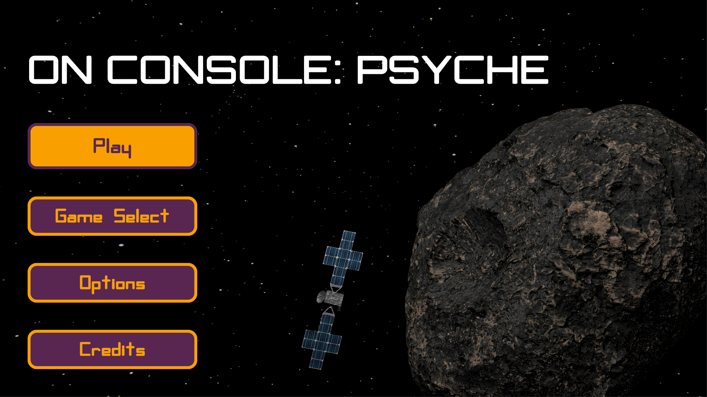

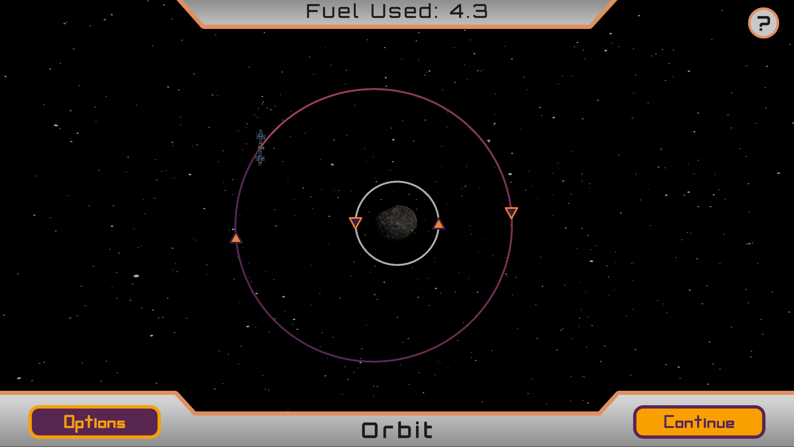

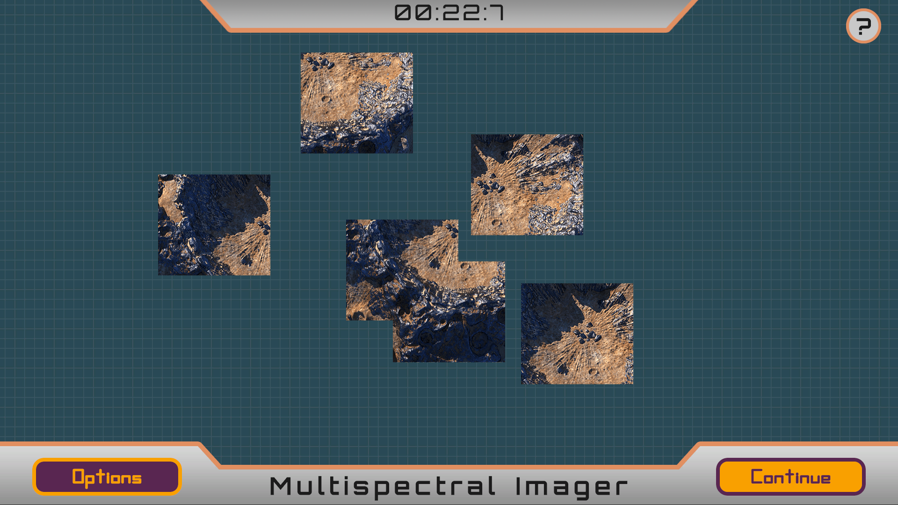

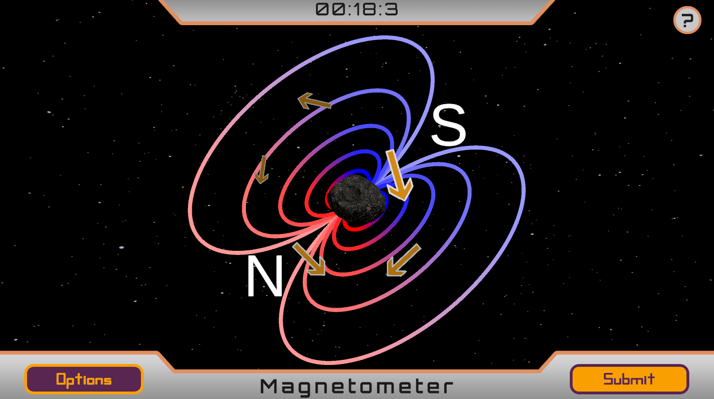

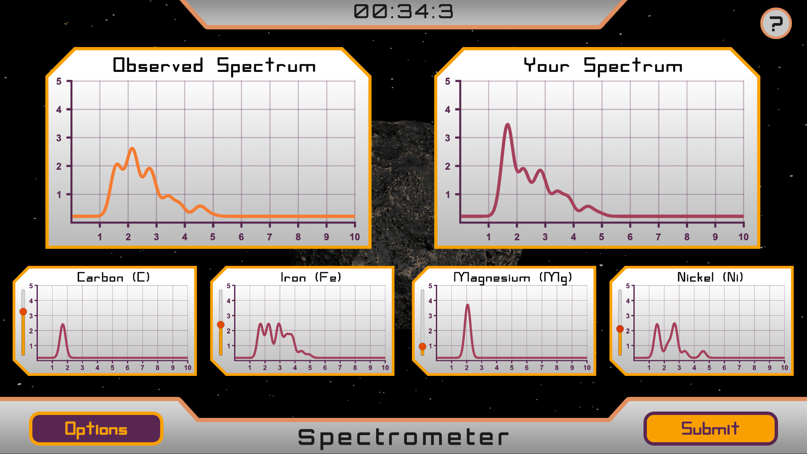

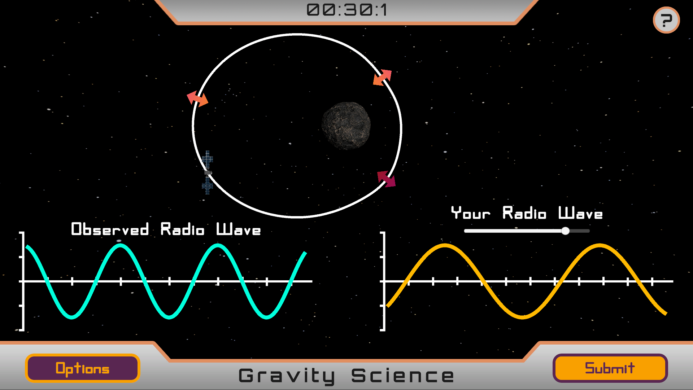

---

## Installing Unity Editor

### Step 1:

Install Unity Hub from [Unity's official website](https://unity.com/download). Once you have run the installer, open Unity Hub and sign in with your Unity account.

### Step 2:

Install the editor by clicking the Install Editor button in the top right corner.

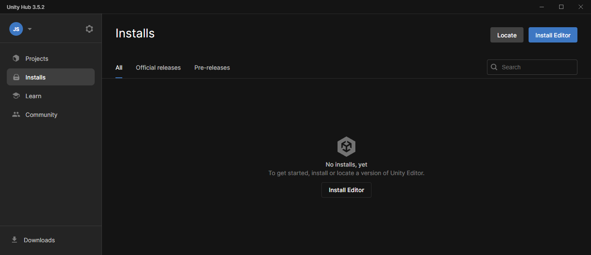

We are using Long Term Support version 2022.3.10f1 for this project, so click the Install button next to that version.

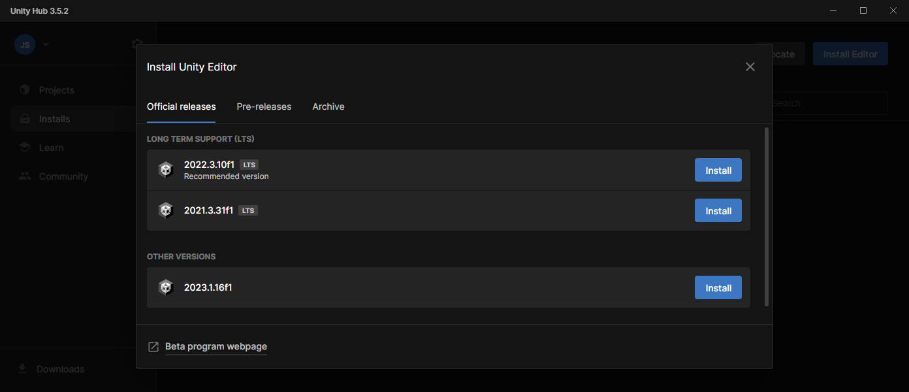

### Step 3:

Ensure that the "WebGL Build Support" option is selected before continuing with the install.

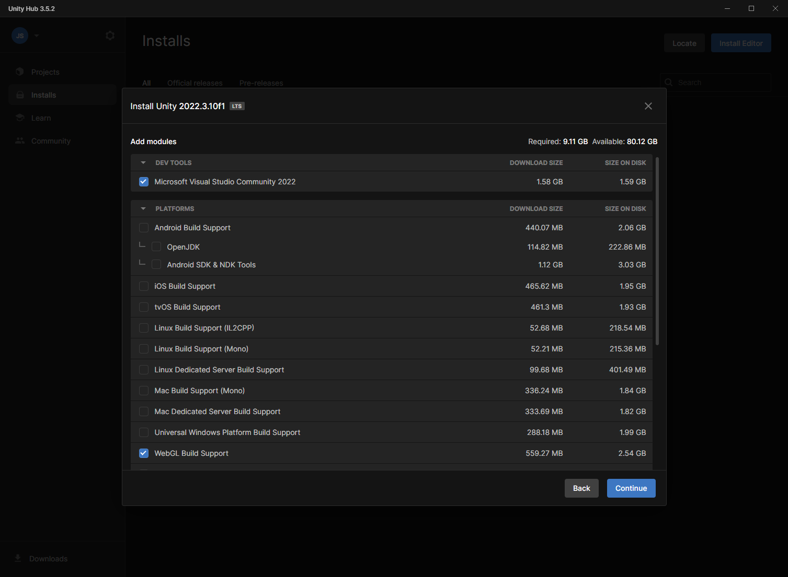

If you selected "Microsoft Visual Studio Community 2022," agree to Microsoft Visual Studio's terms and conditions for being installed, and click the "Install" button.

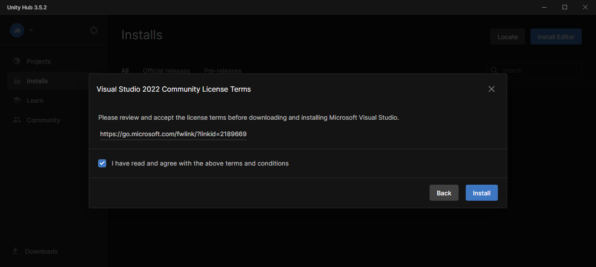

### Step 4:

Once Unity Editor is installed, you can open the project using the Open button in the Projects tab.
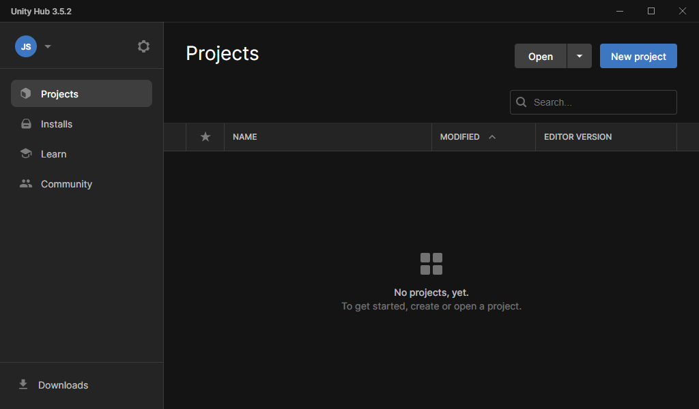

Unity Hub will prompt you to select a folder that contains a project. Select your cloned GitHub repository and Unity will open the project.

---

## How to build?

### Step 1:

In Unity Editor, click on File > Build Settings... or use the keyboard shortcut Ctrl+Shift+B to open the build settings.

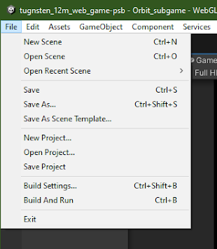

### Step 2:

Verify WebGL is highlighted in the Platform tab, and that Development Build is disabled in the WebGL tab. Set the code optimization to Runtime Speed for best performance. 
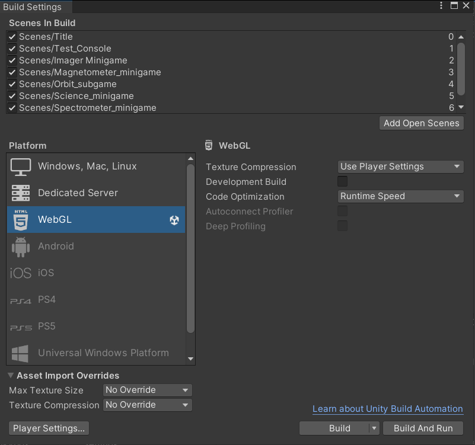

### Step 3:

Click the Build button in the bottom right corner of the Build Settings screen. Unity will prompt you to decide where to save your build.

You should now have two folders called "Build" and "TemplateData", which contain the files required for a web server to serve the Unity project to a user. There is also an index.html file provided that you can use through a service like GitHub pages that will host the build.
